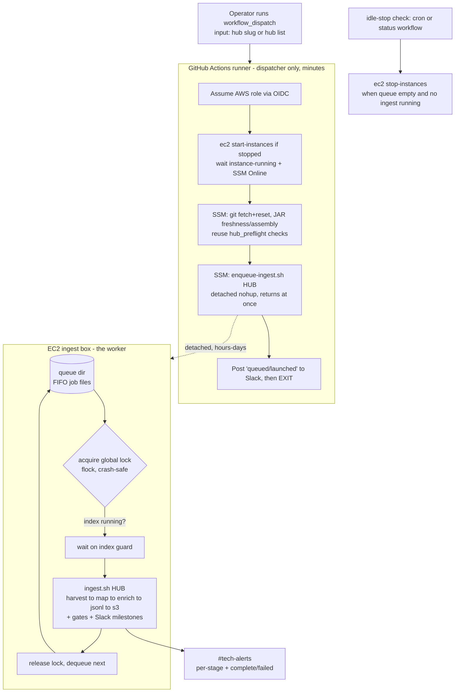

# Partner Ingest via GitHub Actions — Design & Scoping

Status: **Draft for review** · Owner: tech@dp.la · Last updated: 2026-08-21

This document scopes the work to drive a **full partner ("hub") ingest pipeline**
(harvest → mapping → enrichment → JSONL → S3 sync) from **GitHub Actions (GHA)**, in
the same spirit as the Wikimedia pipeline's GHA-triggered runs — but tailored to the
very different resource profile of ingestion.

It answers four questions:

1. Can we scope GHA workflow(s) that kick off the full partner ingest pipeline, where GHA
   sends sequenced SSM commands to a (possibly stopped) EC2 box and progress is reported to
   Slack? (No Lambda/Slack slash-command piece for ingestion — GHA `workflow_dispatch` only.)
2. What is the equivalent of Wikimedia's worker-slots/queue system for ingestion, given that
   ingests are heavier, must run **one at a time**, and must never overlap an index rebuild?
3. One GHA per hub, or one GHA that takes any hub slug?
4. Can this be done in one go, or should it be phased?

**TL;DR** — Yes, this is very doable and most of the machinery already exists. Build **one
parameterized workflow** that acts as a **dispatcher only**: it authenticates to AWS,
starts the ingest box if it is stopped, hands the job to an **on-box serial queue guarded by
a single crash-safe lock** (the ingestion analogue of Wikimedia's flock worker-slots, but
with N=1 and an index guard), confirms the job is queued/running, and exits. The long-running
work runs detached on EC2 and reports to Slack via the existing `ingest.sh` notifications.
Deliver it in **4–5 phases**, not one shot.

---

## 1. How partner ingests run today (baseline)

Established from `scripts/ingest.sh`, `scripts/common.sh`, `ingest_python_scripts/`,
`.claude/skills/dpla-hub-ingest/SKILL.md`, and the orchestrator under `scheduler/orchestrator/`.

- **One EC2 box, normally stopped.** `i-0a0def8581efef783` ("ingest"), `m8g.2xlarge`
  (8 vCPU / **32 GB RAM**, Graviton), Amazon Linux 2023, ~$0.36/hr, kept **stopped between
  ingests**. Reached only via **AWS SSM** (`AWS-RunShellScript`), never SSH. On-box AWS
  access is the **instance role `ingestion3-spark` via IMDS** — `common.sh` deliberately
  strips `AWS_*` env creds so the box always uses its own role (`common.sh:274-285`).
- **One entrypoint runs the whole pipeline.** `scripts/ingest.sh <hub>` runs all five
  stages and already provides: per-stage Slack milestones (`common.sh:298-316`, `#tech-alerts`
  `C02HEU2L3`), status files (`logs/status/<hub>.status`), a 0-record abort at every stage,
  a JSONL id-uniqueness check (`common.sh:585-629`), a **>5% record-drop safety gate vs the
  previous S3 snapshot** (`ingest.sh:404-456`), the partner summary email, and the S3 sync.
  It supports `--resume-from {mapping,enrichment,jsonl}`, `--harvest-only`, `--mapping-only`.
  Per-step heap is hardcoded in the script: harvest `-Xmx15g`, mapping `-Xmx15g`, **enrichment
  `-Xmx18g`**, JSONL `-Xmx12g` (JSONL pinned to `local[1]`).
- **Strictly one hub at a time.** Enrichment alone asks for 18 GB; two hubs' enrichment would
  need ~36 GB and exceed the 32 GB ceiling. The runbook is explicit: *"Hubs cannot run in
  parallel on this instance … always run sequentially"* (`SKILL.md:1163`). `auto-ingest.sh`
  also processes hubs sequentially "to avoid sbt conflicts."
- **Index rebuild is separate and downstream.** The Elasticsearch rebuild (`sparkindexer` on
  EMR, 6–9 h) and the post-index EMR batch run **after all monthly ingests** and touch
  different infrastructure (`ingest_python_scripts/launch_indexer.py`, `SKILL.md:56,1660`).
  Ingests must not compete with, or race, an in-flight index cycle.
- **A Python SSM launcher layer already exists** — `ingest_python_scripts/`:
  - `hub_preflight.py` — **starts the instance if stopped** (`start-instances` + `wait
    instance-running` + wait for SSM `Online`), and checks repo freshness, JAR freshness
    (rebuilds `sbt assembly` if stale), disk, and endpoint reachability.
  - `launch_ingest.py` — fires `ingest.sh <hub>` on the box via SSM as a **detached
    `nohup … &` process** so SSM returns immediately; then you watch Slack.
  - `check_ingest.py` — polls process/stage/record-count status.
  - `ingest-watchdog.sh` — cron every 5 min; posts a `:skull:` Slack alert if a `.status`
    file is "active" but no matching process is alive (SIGKILL/OOM detection).
- **No concurrency guard exists today.** `launch_ingest.py` is fire-and-forget. Nothing stops
  a second ingest from being launched while one is already running, or during an index —
  the only guard is **operator discipline**. This is the gap that a GHA trigger (which can be
  invoked without knowing what's on the box) makes dangerous, and it is the crux of Q2.
- **Special hubs don't use plain `ingest.sh`.** NARA (delta merge → `nara-ingest.sh`),
  Smithsonian (`fix-si.sh` preprocess + checkpoints), Community Webs (SQLite→JSONL export),
  generic `file` hubs (confirm the S3 delivery path first), IP-blocked hubs
  (maryland/getty/hathi — harvested locally), and Tailscale-routed hubs (njde/getty).

---

## 2. How Wikimedia runs (the reference architecture)

Established from `dpla/ingest-wikimedia`: `.github/workflows/wikimedia-*.yml`,
`lambda/wikimedia-slack-dispatch/handler.py`, `ingest_wikimedia/{ssm,worker_slots,slack}.py`,
`scripts/wikimedia_launch.py`, `docs/{architecture,operations}.md`.

```
Slack slash cmd → Lambda (verify sig + workflow_dispatch) → GHA (workflow_dispatch only)
   → scripts/wikimedia_launch.py → boto3 ssm.send_command → EC2 tmux (detached) → Slack
```

The load-bearing ideas we want to borrow:

- **GHA is a dispatcher, not the worker.** The workflow only: updates code on the box, runs
  health checks, and **launches a detached `tmux -d` session** whose script was base64-staged
  to `/tmp` (to dodge SSM's ~25 KB command cap), confirms a `SESSION_STARTED` sentinel, and
  **exits**. The hours/days of real work outlive both GHA's 15-min job limit and SSM's 5-min
  per-command poll limit. This is exactly how a multi-hour ingest can be "started by CI"
  without CI staying attached.
- **Concurrency is enforced on the box, in three layers:** (1) a **memory admission gate**
  (refuse to launch if free RAM < 30%), (2) **session-conflict detection** (drop or, with
  `force`, kill overlapping tmux sessions), and (3) `WorkerSlotBudget` — a box-wide
  **`fcntl.flock`-based semaphore** over slot files. The flock design is the key trick:
  **a lock auto-releases when its holder dies**, so an OOM-killed worker frees its slot with
  no leaked-permit bookkeeping (`worker_slots.py:63-82`). GHA's own `concurrency:` group only
  collapses *identical* dispatches; it does **not** serialize the detached work — the box
  does.
- **Instance lifecycle: none.** The Wikimedia box is **hardcoded and always-on**; a stopped
  box is a hard, Slack-reported failure, never auto-started. **This is the one place
  ingestion must add code that Wikimedia doesn't have** (our box is normally stopped).
- **AWS auth: static IAM keys in GH secrets** (`WIKIMEDIA_AWS_*`), `permissions: contents: read`,
  `persist-credentials: false`. No OIDC. (For ingestion we recommend OIDC instead — see §4.)
- **Slack: two paths.** Ephemeral `response_url` for caller feedback, and
  `chat.postMessage` to `#tech-alerts` for progress. A 6-hourly `wikimedia-upload-status.yml`
  cron reads `tmux ls` + logs and posts a status block.
- **Four workflows:** `launch`, `kill`, `retry`, `upload-status` — all `workflow_dispatch`
  (status also on cron). A good template for our own `launch` / `kill` / `status` set.

---

## 3. Key differences that shape the ingestion design

| Dimension | Wikimedia (today) | Ingestion (needed) | Consequence |
|---|---|---|---|
| Trigger | Slack → Lambda → GHA | **GHA `workflow_dispatch` only** | Simpler: no Lambda/signature/response_url work. |
| GHA role | Dispatcher, fire-and-exit | Same | Reuse the pattern wholesale. |
| Long-run mechanism | detached `tmux -d`, base64-staged | detached (`nohup` today; keep or move to `tmux`) | Already solved on our side by `launch_ingest.py`. |
| Instance | hardcoded, **always-on** | hardcoded, **normally stopped** | **New work:** start-if-stopped + wait SSM Online; stop-when-idle. |
| Concurrency | ~4–5 concurrent (RAM gate + N-slot flock) | **exactly 1**, and **never during an index** | Simpler slot math (N=1) but adds an **index guard**. |
| Ordering | best-effort | monthly batches want FIFO-ish | Add a small queue for ordering + visibility. |
| AWS auth (runner) | static IAM keys | **OIDC role** (recommended) | New IAM role/policy + trust; no long-lived secrets. |
| On-box auth | instance role (IMDS) | unchanged | GHA creds are only for dispatch (SSM/EC2), never passed to the box. |
| Slack | built in Python tools | already built in `ingest.sh` | Reuse; GHA adds only dispatch-level messages. |
| Existing launcher | `scripts/wikimedia_launch.py` | `ingest_python_scripts/launch_ingest.py` + `hub_preflight.py` | ~80% reuse; needs a **non-interactive mode**. |

The single most important consequence: because our real work is **detached and outlives the
GHA run**, a GHA `concurrency:` group is **not sufficient** to prevent two overlapping
ingests (run A can finish dispatching and exit while its detached ingest keeps running for
hours; run B then dispatches on top of it). **The serialization guarantee has to live on the
box.** That is the ingestion equivalent of Wikimedia's flock worker-slots.

---

## 4. Proposed architecture



### 4.1 GHA workflow = dispatcher only

Mirror Wikimedia: the workflow does the minimum bounded work and exits well within the runner
limit. Steps: assume role (OIDC) → start box if stopped → run the preflight/refresh SSM calls
→ SSM-launch the enqueue script detached → post a Slack "queued/launched" message → exit.
**Never** block the runner waiting for the ingest (single hubs run up to ~8–9 h; the GitHub
job cap is 6 h). Progress comes from `ingest.sh`'s own Slack milestones and (later) a status
workflow.

### 4.2 Instance lifecycle (the "box may be down" case)

`hub_preflight.py` already implements start-if-stopped correctly (idempotent when already
running). Wrap that logic non-interactively:

- **Start:** `ec2:DescribeInstances` → if not `running`, `ec2:StartInstances` +
  `ec2 wait instance-running` + poll `ssm:DescribeInstanceInformation` until `PingStatus=Online`.
- **Stop:** do **not** stop from the launch workflow (a queued job may still be pending).
  Stop via a separate **idle-stop check** (cron or the status workflow) that stops the box
  only when the queue is empty **and** no `ingest.sh`/pipeline JVM is running for N minutes.
  This is race-tolerant and avoids killing in-flight or just-enqueued work.

### 4.3 Concurrency — the ingestion "worker system" (answers Q2)

Because ingestion is **strictly serial** and **must not run during an index**, the Wikimedia
N-slot budget collapses to a **single global mutex + a FIFO queue + an index guard**, all
on the box, all crash-safe via `flock`:

- **Global lock (N=1).** A single lock file, held for the whole duration of one hub's
  `ingest.sh`. Use `flock` so the lock **auto-releases if the process dies** (OOM, kill,
  reboot) — the same property that makes Wikimedia's slots robust. No stale-lock cleanup code.
- **FIFO queue.** A queue directory of job descriptors (`<seq>-<hub>.job`). Enqueue is what
  the GHA triggers. A single **drain loop** (started on first enqueue if not already running,
  itself guarded by the global lock so only one drain loop exists) pops the next job, runs
  `ingest.sh <hub>`, then loops until the queue is empty. This gives ordering and visibility
  that raw flock alone doesn't, and cleanly supports "ingest all hubs / run this month" by
  enqueuing many jobs that drain one-by-one.
- **Index guard.** Before starting each job, the drain loop checks an "index in progress"
  signal and waits if set. Cheapest reliable signal: a marker written by
  `launch_indexer.py`/`post_indexer.py` at start and cleared at completion (they already own
  the index lifecycle). A secondary check can query the EMR cluster state. Belt-and-suspenders:
  the launch workflow can refuse to enqueue if the marker is present and no `--force` is given.
- **What the GHA does NOT do:** hold the lock or wait in the queue. It only enqueues. This
  keeps every guarantee on the box, where the detached work lives — exactly the lesson from
  Wikimedia (GH `concurrency:` can't serialize detached work).

> Minimal viable variant (Phase 2a): skip the explicit queue/drain-loop and have each
> detached launch simply `flock -w <timeout>` on the global lock before running `ingest.sh`
> (blocking waiters serialize themselves, like Wikimedia's `acquire()` poll loop). Add the
> FIFO queue dir (Phase 2b) when ordering/visibility for monthly batches is wanted. Both are
> the same lock; the queue is an ordering layer on top.

### 4.4 AWS auth for the runner

Recommend **GitHub OIDC → assume-role**, not static keys:

- Create an IAM role trusted by GitHub's OIDC provider, scoped to
  `repo:dpla/ingestion3:ref:refs/heads/*` (or an environment), with a policy limited to:
  `ec2:DescribeInstances`, `ec2:StartInstances`, `ec2:StopInstances` (on the ingest
  instance ARN), `ssm:SendCommand`, `ssm:GetCommandInvocation`,
  `ssm:DescribeInstanceInformation`, and `s3:GetObject`/`ListBucket` if the runner ever needs
  to read manifests directly.
- Workflow gets `permissions: id-token: write, contents: read` and uses
  `aws-actions/configure-aws-credentials` with `role-to-assume`. (The repo already uses
  `id-token: write` in `docs.yml`, so the pattern is familiar.)
- **The on-box pipeline auth does not change** — the box keeps using its `ingestion3-spark`
  instance role via IMDS. GHA credentials never touch the box; they only authorize the
  dispatch (EC2 start/stop + SSM). Clean blast-radius separation.
- Store `SLACK_BOT_TOKEN`/`SLACK_WEBHOOK` as GH secrets for dispatch-level messages (the box
  already has its own `.env` Slack config for `ingest.sh`).

### 4.5 Slack reporting

Reuse everything: `ingest.sh` already posts start / per-stage / failure / complete to
`#tech-alerts`, and `ingest-watchdog.sh` covers silent-death. The GHA adds only:
"instance starting", "queued behind N job(s)", "launched", and (on dispatch failure) an
error. A later **status workflow** (cron, mirroring `wikimedia-upload-status.yml`) can SSM in,
read the queue + `.status` files, and post a rollup.

---

## 5. One workflow or one-per-hub? (answers Q3)

**One parameterized workflow that takes a hub slug** (plus an optional multi-hub / "month"
input), with internal routing by harvest type — matching Wikimedia's single `launch`
workflow with a `partner` input.

- From the user's seat, "type the slug, run" is far better than N maintained workflows.
- Per-hub workflows would duplicate the identical dispatch/lifecycle/lock logic N times and
  drift. All hub-specific behavior already lives **on the box** (in `i3.conf` and the
  stage scripts); the dispatcher stays generic.
- **Routing by `harvest.type`** (the launcher already reads this): standard `localoai`/`api`/
  `file` hubs → `ingest.sh`; `nara.file.delta` → `nara-ingest.sh`; Smithsonian/Community-Webs
  → their launch scripts; IP-blocked hubs → fail fast with a clear message (local harvest is
  operator-driven). Start with **standard hubs only** and add routes incrementally.
- Batch/month use case ("run this month's ingests") = the same workflow enqueuing multiple
  jobs (derive the list from `i3.conf` schedule months, as the skill's batch helper does),
  all drained serially by the one queue. No separate batch workflow needed.
- Add small sibling workflows later for **kill** and **status** (Wikimedia has these) — they
  are cheap and very useful operationally.

---

## 6. One go, or phased? (answers Q4)

**Phase it.** The end-to-end system spans IAM/OIDC, a non-interactive launcher refactor, an
on-box lock/queue/guard, instance lifecycle, and per-hub-type routing — each with its own
failure modes. Ship the smallest thing that proves the whole chain, then harden. Each phase
is independently useful and independently reviewable.

| Phase | Deliverable | Why / acceptance | Rough size |
|---|---|---|---|
| **0. Prereqs** | OIDC IAM role + least-privilege policy; GH secrets (Slack); **non-interactive flags** on `hub_preflight.py`/`launch_ingest.py` (env/CLI instead of `input()`); confirm `i3.conf` is current on the box. | Runner can assume role and SSM to the box unattended. | S |
| **1. Single-hub launch (no queue)** | One `workflow_dispatch` workflow, `hub` input, **standard hubs only**: assume role → start box → preflight/refresh → SSM-launch `ingest.sh` detached → Slack "launched" → exit. Rely on a **simple fail-fast lock check** ("is an ingest already running? if so, abort with a message"). | Proves the full chain end-to-end on a real small hub (e.g. `sd`). Green run → hub appears as a new S3 JSONL snapshot with the safety gate passed. | M |
| **2. Worker system: lock + queue + index guard** | Replace fail-fast with **enqueue**: on-box global `flock`, FIFO queue dir, single drain loop, and the index-in-progress guard. GHA enqueues; box serializes. | Two back-to-back dispatches run sequentially (second waits), and a dispatch during a (simulated) index waits. This is the core of Q2. | M–L |
| **3. Lifecycle + batch + status** | Idle-stop check (cron or status workflow) to `stop-instances` when idle; multi-hub/"month" input that enqueues many; a cron **status workflow** posting queue + running state to Slack. | Cost control + "run this month" + at-a-glance status. | M |
| **4. Special hubs + kill/retry** | Route `nara.file.delta`, Smithsonian, Community-Webs, generic `file` (delivery-path confirmation), IP-blocked (clear fail); add `kill` and `retry` workflows (mirror Wikimedia). | Full hub coverage + operational controls. | L (incremental) |

Phases 0–1 alone deliver "kick off a standard hub from a button in GitHub." Phase 2 is the
piece the user specifically flagged as needing to be designed in from the start — and it is,
even though it lands as its own phase (Phase 1 uses a deliberately conservative fail-fast lock
so it is never unsafe before the full queue exists).

---

## 7. Reuse map — what exists vs what's new

| Capability | Already exists | New work |
|---|---|---|
| Full pipeline + gates + Slack + email | `scripts/ingest.sh` (+ `common.sh`) | none |
| Start box if stopped, preflight, JAR freshness | `ingest_python_scripts/hub_preflight.py` | wrap **non-interactively** |
| Detached SSM launch of `ingest.sh` | `ingest_python_scripts/launch_ingest.py` | non-interactive; called from GHA |
| Silent-death detection | `scripts/ingest-watchdog.sh` (cron) | none (keep) |
| Per-hub status files | `common.sh` + `scheduler/orchestrator/state.py` | read from status workflow |
| Serial execution / lock / queue / index guard | **nothing** (operator discipline) | **build (Phase 2)** |
| Instance stop-when-idle | manual today | **build (Phase 3)** |
| Runner→AWS auth | `docs.yml` uses `id-token` | **OIDC role + policy (Phase 0)** |
| GHA workflow(s) | only `scala.yml`, `docs.yml` (no ingest) | **build (Phases 1,3,4)** |

---

## 8. Risks & open questions

- **Auto-stop races.** Stopping the box must never kill a running or just-enqueued ingest.
  Mitigation: idle-stop only on "queue empty AND no pipeline process for N minutes"; never
  stop from the launch workflow. Consider leaving auto-stop off until Phase 3 is trusted.
- **Index guard signal.** Decide the authoritative signal for "index in progress" — a marker
  file owned by `launch_indexer.py`/`post_indexer.py` is simplest; an EMR cluster-state check
  is a robust backstop. Needs a small change in the indexer scripts to set/clear the marker.
- **`i3.conf` currency.** The box's `ingestion3-conf` can drift; some `file`-hub endpoints
  still point at old local paths. The preflight `git fetch+reset` covers the code; conf
  freshness for file hubs stays an operator confirmation until Phase 4 automates it.
- **Non-interactive refactor.** `launch_ingest.py`/`hub_preflight.py` use `input()` for file-hub
  delivery confirmation and unknown-harvest-type fallback. Phase 0 must add flags/env to make
  these unattended (and fail safe when a confirmation would have been required).
- **IP-blocked & Tailscale hubs.** maryland/getty/hathi harvest from EC2 is blocked; njde/getty
  route via a Tailscale exit node whose key rotates ~180 days. These stay partly operator-driven;
  the workflow should detect and message rather than silently fail.
- **Runner time budget.** Keep the workflow to dispatch-only; never poll a multi-hour ingest to
  completion on the runner.
- **Ordering under raw flock.** If strict FIFO matters for monthly batches, the queue dir
  (Phase 2b) provides it; raw flock waiters are not strictly ordered.

---

## 9. Appendix — concrete sketches (illustrative, not final)

**Workflow inputs (Phase 1):**

```yaml
on:
  workflow_dispatch:
    inputs:
      hub:    { description: "Hub slug (e.g. sd, bpl)", required: true }
      resume_from: { description: "mapping|enrichment|jsonl (optional)", required: false }
      force:  { description: "Bypass index guard", type: boolean, default: false }
permissions: { id-token: write, contents: read }
```

**Least-privilege IAM policy (dispatch only):** `ec2:{DescribeInstances,StartInstances,
StopInstances}` on the ingest instance ARN; `ssm:{SendCommand,GetCommandInvocation,
DescribeInstanceInformation}`; optional `s3:{GetObject,ListBucket}` on `dpla-master-dataset`.

**On-box lock (Phase 2, crash-safe):**

```bash
# enqueue-ingest.sh <hub>: append job, ensure a single drain loop is running
echo "$hub" >> "$QUEUE_DIR/$(date +%s%N)-$hub.job"
exec 9>"$LOCK"                 # global mutex; flock auto-releases if holder dies
if flock -n 9; then           # we are the drain loop
  nohup drain-queue.sh >/home/ec2-user/data/queue-drain.log 2>&1 </dev/null &
fi
# drain-queue.sh: while queue non-empty: wait-if-index-running; ingest.sh <next>; dequeue
```

This is the ingestion analogue of `ingest_wikimedia/worker_slots.py` — same `flock`
crash-safety, collapsed to a single serial slot plus an index guard.

---

### Sources

- Ingestion: `scripts/ingest.sh`, `scripts/common.sh`, `scripts/ingest-watchdog.sh`,
  `ingest_python_scripts/{README,hub_preflight,launch_ingest,check_ingest}.py`,
  `scheduler/orchestrator/{config,hub_processor,state,notifications,anomaly_detector}.py`,
  `.claude/skills/dpla-hub-ingest/SKILL.md`, `docs/ingestion/README_{INGESTS,NARA,SMITHSONIAN}.md`.
- Wikimedia (`dpla/ingest-wikimedia`): `.github/workflows/wikimedia-{launch,kill,retry,upload-status}.yml`,
  `lambda/wikimedia-slack-dispatch/handler.py`, `ingest_wikimedia/{ssm,worker_slots,slack}.py`,
  `scripts/wikimedia_launch.py`, `docs/{architecture,operations}.md`.
