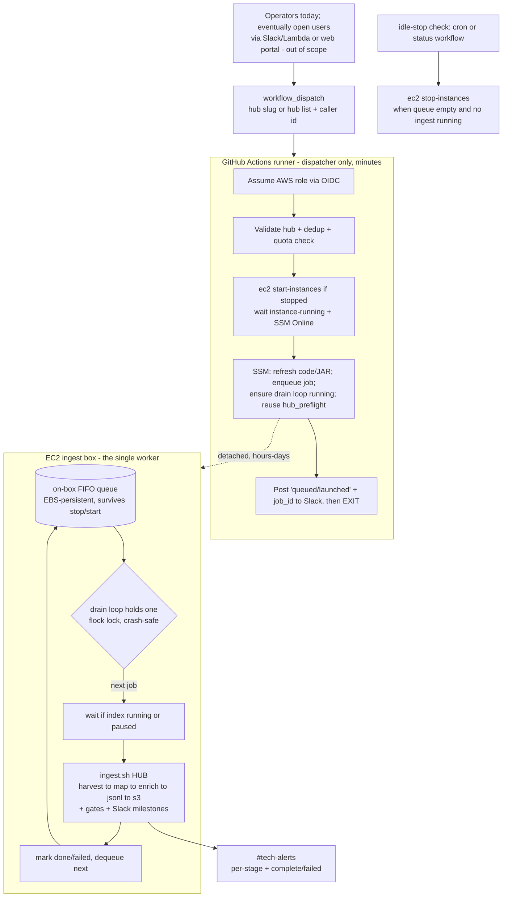

# Partner Ingest via GitHub Actions — Design & Scoping

Status: **Draft for review** · Owner: tech@dp.la · Last updated: 2026-08-21

This document scopes the work to drive a **full partner ("hub") ingest pipeline**
(harvest → mapping → enrichment → JSONL → S3 sync) from **GitHub Actions (GHA)**, in
the same spirit as the Wikimedia pipeline's GHA-triggered runs — but tailored to the
very different resource profile of ingestion.

It answers four questions:

1. Can we scope GHA workflow(s) that kick off the full partner ingest pipeline, where GHA
   sends sequenced SSM commands to a (possibly stopped) EC2 box and progress is reported to
   Slack? (No Lambda/Slack slash-command piece for ingestion — GHA `workflow_dispatch` only.)
2. What is the equivalent of Wikimedia's worker-slots/queue system for ingestion, given that
   ingests are heavier, must run **one at a time**, and must never overlap an index rebuild?
3. One GHA per hub, or one GHA that takes any hub slug?
4. Can this be done in one go, or should it be phased?

**TL;DR** — Yes, this is very doable and most of the machinery already exists. Build **one
parameterized workflow** that acts as a **dispatcher only**: it authenticates to AWS, starts
the ingest box if it is stopped, and hands the job to an **automated on-box queue** — managed
by the box itself, exactly like Wikimedia's worker-slot system, but collapsed to **one slot**
(a crash-safe lock) plus an **index guard**. GHA confirms the job is queued/running and exits;
the long-running work runs detached on EC2 and reports to Slack via the existing `ingest.sh`
notifications. Operators (and eventually open users) trigger jobs but never touch the queue.
Deliver it in **~5 phases**, not one shot.

### Intended end state: an open, multi-user trigger layer

The GHA trigger is the **operator layer moved one level removed from the EC2**. The eventual
goal is to front it (via a Slack/Lambda or Lambda→web-portal flow — **out of scope to build
here**) so that **users without any access to DPLA's EC2 or backend** can request ingests.
That reframes the queue and controls from "convenience" to **load-bearing safety**: multiple
independent, semi-trusted callers may fire triggers concurrently, and the system must
guarantee that **no job is silently lost, no caller can starve or overload the box, and no
caller can step on DPLA's own work** (ingests or index rebuilds). Everything below is designed
so the trigger layer is *replaceable and untrusted* — all durability, validation, quota, and
admission logic lives on **our** side of GHA, never solely in the front end. See §4.6.

---

## 1. How partner ingests run today (baseline)

Established from `scripts/ingest.sh`, `scripts/common.sh`, `ingest_python_scripts/`,
`.claude/skills/dpla-hub-ingest/SKILL.md`, and the orchestrator under `scheduler/orchestrator/`.

- **One EC2 box, normally stopped.** `i-0a0def8581efef783` ("ingest"), `m8g.2xlarge`
  (8 vCPU / **32 GB RAM**, Graviton), Amazon Linux 2023, ~$0.36/hr, kept **stopped between
  ingests**. Reached only via **AWS SSM** (`AWS-RunShellScript`), never SSH. On-box AWS
  access is the **instance role `ingestion3-spark` via IMDS** — `common.sh` deliberately
  strips `AWS_*` env creds so the box always uses its own role (`common.sh:274-285`).
- **One entrypoint runs the whole pipeline.** `scripts/ingest.sh <hub>` runs all five
  stages and already provides: per-stage Slack milestones (`common.sh:298-316`, `#tech-alerts`
  `C02HEU2L3`), status files (`logs/status/<hub>.status`), a 0-record abort at every stage,
  a JSONL id-uniqueness check (`common.sh:585-629`), a **>5% record-drop safety gate vs the
  previous S3 snapshot** (`ingest.sh:404-456`), the partner summary email, and the S3 sync.
  It supports `--resume-from {mapping,enrichment,jsonl}`, `--harvest-only`, `--mapping-only`.
  Per-step heap is hardcoded in the script: harvest `-Xmx15g`, mapping `-Xmx15g`, **enrichment
  `-Xmx18g`**, JSONL `-Xmx12g` (JSONL pinned to `local[1]`).
- **Strictly one hub at a time.** Enrichment alone asks for 18 GB; two hubs' enrichment would
  need ~36 GB and exceed the 32 GB ceiling. The runbook is explicit: *"Hubs cannot run in
  parallel on this instance … always run sequentially"* (`SKILL.md:1163`). `auto-ingest.sh`
  also processes hubs sequentially "to avoid sbt conflicts."
- **Index rebuild is separate and downstream.** The Elasticsearch rebuild (`sparkindexer` on
  EMR, 6–9 h) and the post-index EMR batch run **after all monthly ingests** and touch
  different infrastructure (`ingest_python_scripts/launch_indexer.py`, `SKILL.md:56,1660`).
  Ingests must not compete with, or race, an in-flight index cycle.
- **A Python SSM launcher layer already exists** — `ingest_python_scripts/`:
  - `hub_preflight.py` — **starts the instance if stopped** (`start-instances` + `wait
    instance-running` + wait for SSM `Online`), and checks repo freshness, JAR freshness
    (rebuilds `sbt assembly` if stale), disk, and endpoint reachability.
  - `launch_ingest.py` — fires `ingest.sh <hub>` on the box via SSM as a **detached
    `nohup … &` process** so SSM returns immediately; then you watch Slack.
  - `check_ingest.py` — polls process/stage/record-count status.
  - `ingest-watchdog.sh` — cron every 5 min; posts a `:skull:` Slack alert if a `.status`
    file is "active" but no matching process is alive (SIGKILL/OOM detection).
- **No concurrency guard exists today.** `launch_ingest.py` is fire-and-forget. Nothing stops
  a second ingest from being launched while one is already running, or during an index —
  the only guard is **operator discipline**. This is the gap that a GHA trigger (which can be
  invoked without knowing what's on the box) makes dangerous, and it is the crux of Q2.
- **Special hubs don't use plain `ingest.sh`.** NARA (delta merge → `nara-ingest.sh`),
  Smithsonian (`fix-si.sh` preprocess + checkpoints), Community Webs (SQLite→JSONL export),
  generic `file` hubs (confirm the S3 delivery path first), IP-blocked hubs
  (maryland/getty/hathi — harvested locally), and Tailscale-routed hubs (njde/getty).

---

## 2. How Wikimedia runs (the reference architecture)

Established from `dpla/ingest-wikimedia`: `.github/workflows/wikimedia-*.yml`,
`lambda/wikimedia-slack-dispatch/handler.py`, `ingest_wikimedia/{ssm,worker_slots,slack}.py`,
`scripts/wikimedia_launch.py`, `docs/{architecture,operations}.md`.

```
Slack slash cmd → Lambda (verify sig + workflow_dispatch) → GHA (workflow_dispatch only)
   → scripts/wikimedia_launch.py → boto3 ssm.send_command → EC2 tmux (detached) → Slack
```

The load-bearing ideas we want to borrow:

- **GHA is a dispatcher, not the worker.** The workflow only: updates code on the box, runs
  health checks, and **launches a detached `tmux -d` session** whose script was base64-staged
  to `/tmp` (to dodge SSM's ~25 KB command cap), confirms a `SESSION_STARTED` sentinel, and
  **exits**. The hours/days of real work outlive both GHA's 15-min job limit and SSM's 5-min
  per-command poll limit. This is exactly how a multi-hour ingest can be "started by CI"
  without CI staying attached.
- **Concurrency is enforced on the box, in three layers:** (1) a **memory admission gate**
  (refuse to launch if free RAM < 30%), (2) **session-conflict detection** (drop or, with
  `force`, kill overlapping tmux sessions), and (3) `WorkerSlotBudget` — a box-wide
  **`fcntl.flock`-based semaphore** over slot files. The flock design is the key trick:
  **a lock auto-releases when its holder dies**, so an OOM-killed worker frees its slot with
  no leaked-permit bookkeeping (`worker_slots.py:63-82`). GHA's own `concurrency:` group only
  collapses *identical* dispatches; it does **not** serialize the detached work — the box
  does.
- **Instance lifecycle: none.** The Wikimedia box is **hardcoded and always-on**; a stopped
  box is a hard, Slack-reported failure, never auto-started. **This is the one place
  ingestion must add code that Wikimedia doesn't have** (our box is normally stopped).
- **AWS auth: static IAM keys in GH secrets** (`WIKIMEDIA_AWS_*`), `permissions: contents: read`,
  `persist-credentials: false`. No OIDC. (For ingestion we recommend OIDC instead — see §4.)
- **Slack: two paths.** Ephemeral `response_url` for caller feedback, and
  `chat.postMessage` to `#tech-alerts` for progress. A 6-hourly `wikimedia-upload-status.yml`
  cron reads `tmux ls` + logs and posts a status block.
- **Four workflows:** `launch`, `kill`, `retry`, `upload-status` — all `workflow_dispatch`
  (status also on cron). A good template for our own `launch` / `kill` / `status` set.

---

## 3. Key differences that shape the ingestion design

| Dimension | Wikimedia (today) | Ingestion (needed) | Consequence |
|---|---|---|---|
| Trigger | Slack → Lambda → GHA | **GHA `workflow_dispatch` only** | Simpler: no Lambda/signature/response_url work. |
| GHA role | Dispatcher, fire-and-exit | Same | Reuse the pattern wholesale. |
| Long-run mechanism | detached `tmux -d`, base64-staged | detached (`nohup` today; keep or move to `tmux`) | Already solved on our side by `launch_ingest.py`. |
| Instance | hardcoded, **always-on** | hardcoded, **normally stopped** | **New work:** start-if-stopped + wait SSM Online; stop-when-idle. |
| Concurrency | ~4–5 concurrent (RAM gate + N-slot flock) | **exactly 1**, and **never during an index** | Simpler slot math (N=1) but adds an **index guard**. |
| Ordering | best-effort | monthly batches want FIFO-ish | Add a small queue for ordering + visibility. |
| AWS auth (runner) | static IAM keys | **OIDC role** (recommended) | New IAM role/policy + trust; no long-lived secrets. |
| On-box auth | instance role (IMDS) | unchanged | GHA creds are only for dispatch (SSM/EC2), never passed to the box. |
| Slack | built in Python tools | already built in `ingest.sh` | Reuse; GHA adds only dispatch-level messages. |
| Existing launcher | `scripts/wikimedia_launch.py` | `ingest_python_scripts/launch_ingest.py` + `hub_preflight.py` | ~80% reuse; needs a **non-interactive mode**. |

The single most important consequence: because our real work is **detached and outlives the
GHA run**, a GHA `concurrency:` group is **not sufficient** to prevent two overlapping
ingests (run A can finish dispatching and exit while its detached ingest keeps running for
hours; run B then dispatches on top of it). **The serialization guarantee has to live on the
box.** That is the ingestion equivalent of Wikimedia's flock worker-slots.

---

## 4. Proposed architecture



### 4.1 GHA workflow = dispatcher only

Mirror Wikimedia: the workflow does the minimum bounded work and exits well within the runner
limit. Steps: assume role (OIDC) → start box if stopped → run the preflight/refresh SSM calls
→ SSM-launch the enqueue script detached → post a Slack "queued/launched" message → exit.
**Never** block the runner waiting for the ingest (single hubs run up to ~8–9 h; the GitHub
job cap is 6 h). Progress comes from `ingest.sh`'s own Slack milestones and (later) a status
workflow.

### 4.2 Instance lifecycle (the "box may be down" case)

`hub_preflight.py` already implements start-if-stopped correctly (idempotent when already
running). Wrap that logic non-interactively:

- **Start:** `ec2:DescribeInstances` → if not `running`, `ec2:StartInstances` +
  `ec2 wait instance-running` + poll `ssm:DescribeInstanceInformation` until `PingStatus=Online`.
- **Stop:** do **not** stop from the launch workflow (a queued job may still be pending).
  Stop via a separate **idle-stop check** (cron or the status workflow) that stops the box
  only when the queue is empty **and** no `ingest.sh`/pipeline JVM is running for N minutes.
  This is race-tolerant and avoids killing in-flight or just-enqueued work.

### 4.3 Concurrency — the ingestion "worker system" (answers Q2)

Ingestion is **strictly serial** and **must not run during an index**, so Wikimedia's N-slot
flock budget collapses to a **single execution slot + a FIFO queue + an index guard** — an
**automated, on-box** system the box runs itself (operators never manage it), exactly the
Wikimedia-worker analogy:

- **On-box execution slot (N=1), crash-safe.** A single **drain loop** runs on the box and
  holds one `flock` lock for its lifetime, so only one drain loop and one `ingest.sh` ever run
  at once. `flock` **auto-releases if the process dies** (OOM, kill, reboot) — the property
  that makes Wikimedia's slots robust — so a crash frees the slot with no stale-lock cleanup.
- **FIFO queue on persistent EBS (not `/tmp`).** A queue directory under
  `/home/ec2-user/data/queue/` holds one descriptor per job (`<seq>-<hub>` + requester +
  options). Because it lives on the **EBS volume, it survives stop/start and reboot** — only
  `/tmp` is wiped. The drain loop pops the next job, runs `ingest.sh <hub>`, and loops until
  the queue is empty; this gives ordering + visibility that raw flock alone doesn't, and
  cleanly supports "ingest all hubs / run this month" by enqueuing many jobs that drain
  one-by-one.
- **Crash recovery.** On drain-loop startup, sweep any job left in an `in-progress` state whose
  process is gone and return it to `queued`, so an OOM/reboot mid-run resumes instead of losing
  the job. (EBS persistence + this sweep give the "no lost jobs" guarantee without an off-box
  store — see the note below.)
- **Index guard.** Before starting each job, the drain loop checks an "index in progress"
  signal and waits if set. Cheapest reliable signal: a marker file written by
  `launch_indexer.py`/`post_indexer.py` at start and cleared at completion (they already own
  the index lifecycle). An EMR cluster-state check is a robust backstop.
- **What the GHA runner does:** start the box if stopped (so it's up before hand-off — SSM
  needs it running anyway) → SSM-**enqueue** the job into the on-box queue and ensure the drain
  loop is running (idempotent) → post to Slack → exit. It **never** holds the lock or waits in
  the queue. Every serialization guarantee lives where the detached work lives — the lesson
  from Wikimedia (a GH `concurrency:` group cannot serialize work that outlives the run).

> **Why on-box, not an external queue?** Because the box is always running at enqueue time
> (GHA just started it), the queue on EBS survives crashes/restarts, and remote status comes
> from a status workflow that reads the on-box queue (as `wikimedia-upload-status.yml` reads
> `tmux ls`). An off-box store (SQS/DynamoDB) would only add value if we needed to *accept a
> request while the box cannot be started at all* — a rare failure we can revisit later; it is
> not worth the extra service/IAM/code now.

> Interim for the operator-only bootstrap (Phase 1): a conservative `flock` fail-fast ("an
> ingest is already running — aborting") is safe while access is limited to operators who can
> retry. It is **explicitly not the open-access shape** — a rejected trigger is a lost job for
> someone who can't diagnose the box, so the full queue (Phase 2) must land before the trigger
> is opened beyond operators.

### 4.4 AWS auth for the runner

Recommend **GitHub OIDC → assume-role**, not static keys:

- Create an IAM role trusted by GitHub's OIDC provider, scoped to
  `repo:dpla/ingestion3:ref:refs/heads/*` (or an environment), with a policy limited to:
  `ec2:DescribeInstances`, `ec2:StartInstances`, `ec2:StopInstances` (on the ingest
  instance ARN), `ssm:SendCommand`, `ssm:GetCommandInvocation`,
  `ssm:DescribeInstanceInformation` (the runner enqueues by SSM-ing the job onto the box), and
  `s3:GetObject`/`ListBucket` if the runner ever needs to read manifests directly.
- Workflow gets `permissions: id-token: write, contents: read` and uses
  `aws-actions/configure-aws-credentials` with `role-to-assume`. (The repo already uses
  `id-token: write` in `docs.yml`, so the pattern is familiar.)
- **The on-box pipeline auth does not change** — the box keeps using its `ingestion3-spark`
  instance role via IMDS. GHA credentials never touch the box; they only authorize the
  dispatch (EC2 start/stop + SSM). Clean blast-radius separation.
- Store `SLACK_BOT_TOKEN`/`SLACK_WEBHOOK` as GH secrets for dispatch-level messages (the box
  already has its own `.env` Slack config for `ingest.sh`).

### 4.5 Slack reporting

Reuse everything: `ingest.sh` already posts start / per-stage / failure / complete to
`#tech-alerts`, and `ingest-watchdog.sh` covers silent-death. The GHA adds only:
"instance starting", "queued behind N job(s)", "launched", and (on dispatch failure) an
error. A later **status workflow** (cron, mirroring `wikimedia-upload-status.yml`) can SSM in,
read the queue + `.status` files, and post a rollup.

For the open end state, each job also carries a **`job_id`**; the trigger layer surfaces its
status by asking the **status workflow** (which SSMs in and reads the on-box queue + `.status`
files), giving a requester who can't see Slack or the box a feedback channel.

### 4.6 Designing for the open, multi-user trigger layer

Because the trigger is meant to eventually accept requests from callers with **no EC2/backend
access** (§ Intended end state), the enqueue boundary must enforce admission and fairness
**itself** — never assume the front end is trusted or even present. These controls belong on
our side of GHA (in the enqueue step and the on-box drain loop), so they hold no matter what
fronts the trigger:

- **Strict input validation.** Resolve the hub slug against the authoritative hub list from
  `i3.conf`; reject anything unknown. Slugs already flow through base64/SSM (no shell
  injection), but the open boundary must additionally reject non-standard/unsupported hubs
  with a clear message rather than attempting them.
- **Idempotency / dedup.** If a hub is already `queued` or `running`, coalesce the new request
  onto the existing job (attach the new requester) instead of enqueuing a duplicate — the
  analogue of Wikimedia's session-conflict detection. Prevents double-runs and accidental
  spam-runs of the same hub.
- **Per-caller quotas and rate limits.** Cap concurrent queued jobs per requester and runs per
  day (counted from the requester tag on queue entries + a small on-box tally) so one caller's
  big batch can't monopolize the single box or burn GitHub Actions minutes. Plain FIFO alone
  lets one batch starve others; enforce a per-caller in-flight cap (and consider fair-share
  ordering) on top of FIFO.
- **Privilege split.** Sensitive actions are **operator-only** and must not be exposable to
  open callers: `force` (bypasses the index guard), `kill`, `resume-from`, arbitrary/special
  hubs, and queue **pause**. Open callers get only "request a standard-hub ingest." Implement
  as separate operator-gated workflows/inputs (GitHub environments + required reviewers, or a
  distinct restricted workflow), not a single `force` checkbox anyone can tick.
- **Protecting DPLA's own work.** Two controls beyond the index guard: (1) a global
  **pause/maintenance flag** the drain loop honors — jobs keep queuing durably but don't
  execute while DPLA runs sensitive operations; (2) an operator **priority lane** so DPLA/
  time-sensitive jobs jump ahead of open-user jobs (echoes Wikimedia's additive uploader
  priority slots).
- **Authorization hook.** Carry an authenticated requester identity on every job and check it
  against an allow policy (e.g. a partner may trigger only their own hub). The policy check is
  the trigger layer's job to *populate*, but the enqueue step must *enforce* whatever identity
  it is given and default to deny for anything unrecognized.
- **Backpressure = queue, never reject or block.** Under load the answer is always "durably
  queued at position N," surfaced via the `job_id`. Never fail-fast a real user's request
  (that loses their job) and never hold a runner waiting (that burns minutes and hits the 6 h
  cap). This is why the durable on-box queue (§4.3) is a prerequisite for opening access, not
  a later nicety.
- **Cost/DoS bounds.** Idle-stop keeps the box from being held up by sporadic triggers; the
  per-caller quotas bound both compute and Actions-minute spend; audit records make abuse
  visible and attributable.

None of this requires building the Lambda/portal now — it requires building the queue and the
enqueue-time controls now, so the front end can be added later without re-plumbing safety.

---

## 5. One workflow or one-per-hub? (answers Q3)

**One parameterized workflow that takes a hub slug** (plus an optional multi-hub / "month"
input), with internal routing by harvest type — matching Wikimedia's single `launch`
workflow with a `partner` input.

- From the user's seat, "type the slug, run" is far better than N maintained workflows.
- Per-hub workflows would duplicate the identical dispatch/lifecycle/lock logic N times and
  drift. All hub-specific behavior already lives **on the box** (in `i3.conf` and the
  stage scripts); the dispatcher stays generic.
- **Routing by `harvest.type`** (the launcher already reads this): standard `localoai`/`api`/
  `file` hubs → `ingest.sh`; `nara.file.delta` → `nara-ingest.sh`; Smithsonian/Community-Webs
  → their launch scripts; IP-blocked hubs → fail fast with a clear message (local harvest is
  operator-driven). Start with **standard hubs only** and add routes incrementally.
- Batch/month use case ("run this month's ingests") = the same workflow enqueuing multiple
  jobs (derive the list from `i3.conf` schedule months, as the skill's batch helper does),
  all drained serially by the one queue. No separate batch workflow needed.
- Add small sibling workflows later for **kill** and **status** (Wikimedia has these) — they
  are cheap and very useful operationally.

---

## 6. One go, or phased? (answers Q4)

**Phase it.** The end-to-end system spans IAM/OIDC, a non-interactive launcher refactor, a
durable on-box queue + single execution slot + index guard, instance lifecycle, multi-user
controls, and per-hub-type routing — each with its own failure modes. Ship the smallest thing
that proves the whole chain, then harden. Each phase is independently useful and reviewable.

The phases are also an **access-widening ladder**: Phases 0–2 are usable by operators only;
**the trigger must not be opened beyond operators until Phase 3 (controls) is in place**,
because that is what makes concurrent, semi-trusted callers safe.

| Phase | Deliverable | Why / acceptance | Rough size |
|---|---|---|---|
| **0. Prereqs** | OIDC IAM role + least-privilege policy; GH secrets (Slack); **non-interactive flags** on `hub_preflight.py`/`launch_ingest.py` (env/CLI instead of `input()`); confirm `i3.conf` is current on the box. | Runner can assume role and SSM to the box unattended. | S |
| **1. Single-hub launch (operator-only, no queue)** | One `workflow_dispatch` workflow, `hub` input, **standard hubs only**: assume role → start box → preflight/refresh → SSM-launch `ingest.sh` detached → Slack "launched" → exit. Conservative **fail-fast lock** ("an ingest is already running — aborting"). Explicitly operator-only. | Proves the full chain end-to-end on a real small hub (e.g. `sd`). Green run → new S3 JSONL snapshot with the safety gate passed. | M |
| **2. Automated on-box queue + execution slot + index guard** | **EBS-persistent FIFO queue** the runner enqueues via SSM; on-box **single drain loop** holding one crash-safe `flock`, running jobs one at a time; startup sweep re-queues orphaned in-progress jobs; **index-in-progress guard**. GHA enqueues, never blocks. | No job lost across box stop/start or crash. Two back-to-back dispatches serialize; a dispatch during a (simulated) index waits. Core of Q2. | M–L |
| **3. Multi-user controls (gates opening access)** | At the enqueue boundary + drain loop: strict hub validation, **dedup/coalescing**, **per-caller quotas/rate limits**, **privilege split** (force/kill/resume/special-hubs/pause = operator-only), global **pause flag**, operator **priority lane**, requester identity + **authz hook**, per-`job_id` status, audit records. | A flood of concurrent requests can't starve/overload the box or step on DPLA work; every request is durably queued and attributable. **Prerequisite for exposing the trigger to non-operators.** | L |
| **4. Lifecycle + batch + status** | Idle-stop check to `stop-instances` when queue empty and no pipeline process for N min; multi-hub/"month" input that enqueues many; cron **status workflow** posting queue + running state to Slack. | Cost control + "run this month" + at-a-glance status + remote feedback. | M |
| **5. Special hubs + kill/retry** | Route `nara.file.delta`, Smithsonian, Community-Webs, generic `file` (delivery-path confirmation), IP-blocked (clear fail); add operator-only `kill` and `retry` workflows (mirror Wikimedia). | Full hub coverage + operational controls. | L (incremental) |

Phases 0–1 alone deliver "an operator kicks off a standard hub from a button in GitHub."
Phases 2–3 are the pieces the open/multi-user end state makes non-negotiable — durability so no
one's job is lost, and controls so no one steps on anyone else or on DPLA's work — and both
must precede widening access beyond operators.

---

## 7. Reuse map — what exists vs what's new

| Capability | Already exists | New work |
|---|---|---|
| Full pipeline + gates + Slack + email | `scripts/ingest.sh` (+ `common.sh`) | none |
| Start box if stopped, preflight, JAR freshness | `ingest_python_scripts/hub_preflight.py` | wrap **non-interactively** |
| Detached SSM launch of `ingest.sh` | `ingest_python_scripts/launch_ingest.py` | non-interactive; called from GHA |
| Silent-death detection | `scripts/ingest-watchdog.sh` (cron) | none (keep) |
| Per-hub status files | `common.sh` + `scheduler/orchestrator/state.py` | read from status workflow |
| Serial execution slot + index guard | **nothing** (operator discipline) | **build (Phase 2)** |
| Automated on-box queue (EBS-persistent, no lost jobs) | **nothing** | **build (Phase 2)** |
| Multi-user controls (dedup, quotas, privilege split, pause, priority, authz, audit) | **nothing** | **build (Phase 3)** |
| Instance stop-when-idle | manual today | **build (Phase 4)** |
| Runner→AWS auth | `docs.yml` uses `id-token` | **OIDC role + policy (Phase 0)** |
| GHA workflow(s) | only `scala.yml`, `docs.yml` (no ingest) | **build (Phases 1,4,5)** |

---

## 8. Where the work lives — GHA vs repo code vs infra/config

**It cannot be done in GHA YAML alone — and shouldn't be.** By design (the lesson borrowed
from Wikimedia) the workflow is a thin **dispatcher**: it authenticates, starts the box,
hands off one SSM call, posts to Slack, and exits. The durable, serialized, stateful logic —
the queue, the single-slot lock, the index guard, the drain loop — **must** live where the
work runs (the box), because a GHA runner is ephemeral and time-limited: state created in a
run evaporates when it ends, and it cannot serialize work that outlives the run. So the bulk
of the new code is in-repo scripts that the box executes, not in `.github/workflows/`.

| Component | Where it lives | New / change | Notes |
|---|---|---|---|
| Dispatcher workflow(s) | `.github/workflows/*.yml` (ingestion3) | **new** | Thin: OIDC → start box → one SSM enqueue → Slack → exit. Operator-gated variant uses GitHub environments. |
| Queue + slot + drain loop + index guard | `scripts/` (ingestion3, **runs on the box**) | **new** | `enqueue-ingest.sh`, `drain-queue.sh`, `flock` lock, EBS queue dir, orphan sweep, index-guard check. The core of the effort. |
| Non-interactive launcher | `ingest_python_scripts/{hub_preflight,launch_ingest}.py` | **change** | Replace `input()` prompts with flags/env so GHA can drive them unattended. |
| Multi-user controls | on-box enqueue/drain (`scripts/`) **+** GitHub environments/required-reviewers | **new** | Dedup, quotas, pause, priority, authz hook, audit live on-box; the operator/open **privilege split** is partly GitHub repo config. |
| Index-in-progress marker | `ingest_python_scripts/{launch_indexer,post_indexer}.py` | **change** | Write a marker on index start, clear on finish — the guard signal. Small change in a different part of the codebase. |
| Pipeline itself | `scripts/ingest.sh` (+ `common.sh`) | **little/none** | Already does stages + gates + Slack + `.status` + email; the drain loop consumes its exit code / status files. |
| Runner→AWS auth | IAM **OIDC provider + role + policy** (AWS) | **new, not in app repo** | Terraform or console; workflow adds `id-token: write` + `role-to-assume`. |
| GitHub config | repo **secrets** (Slack) + **environments/reviewers** | **new, repo settings** | Not code. |
| Box provisioning | EC2 (EBS queue dir; drain-loop launch; repo auto-pull) | **small infra** | Box already has the repo, `mise`, Java; queue dir + a systemd unit or `nohup` launch is the delta. |
| Hub config | `ingestion3-conf` (**separate repo**) | **dependency** | Hub list/endpoints; some `file`-hub endpoints still point at old local paths and need cleanup. |
| Wikimedia repo | `dpla/ingest-wikimedia` | **none** | Reference architecture only. |

**Bottom line — five buckets of change, of which GHA YAML is the smallest (~10–20%):**
(1) new GHA workflow YAML; (2) **new on-box scripts under `scripts/` — the bulk of the work**;
(3) a non-interactive refactor of the `ingest_python_scripts/` launchers; (4) a small marker
change in the indexer scripts; and (5) non-code infra/config (IAM OIDC role, GitHub
secrets/environments, minor box setup) plus the separate `ingestion3-conf` dependency.
Buckets 1–4 all land in the ingestion3 repo and are reviewable as normal PRs (the box just
pulls the repo and runs them); only the IAM, GitHub settings, and box provisioning happen
outside a code PR.

---

## 9. Risks & open questions

- **Auto-stop races.** Stopping the box must never kill a running or just-enqueued ingest.
  Mitigation: idle-stop only on "queue empty AND no pipeline process for N minutes"; never
  stop from the launch workflow. Consider leaving auto-stop off until Phase 4 is trusted.
- **Durability & orphaned jobs.** The queue must survive box stop/start and crashes → put it on
  the **EBS volume, not `/tmp`** (which is wiped on reboot), and on drain-loop startup **sweep
  in-progress jobs whose process is gone back to `queued`** so an OOM/reboot mid-run resumes
  instead of losing the job. Decide the retry policy for a job that repeatedly fails vs. re-queues.
- **Fairness & abuse (open access).** Concurrent semi-trusted callers can starve each other or
  the box. Needs per-caller quotas/rate limits, dedup/coalescing, and (optionally) fair-share
  ordering — not plain FIFO alone. Must be enforced at the enqueue boundary, not the front end.
- **Privilege escalation via inputs.** `force` bypasses the index guard; `kill`/`resume`/
  special-hubs are powerful. These must be operator-gated (GitHub environments/required
  reviewers or a separate restricted workflow), never a checkbox on an open trigger.
- **Index guard signal.** Decide the authoritative signal for "index in progress" — a marker
  file owned by `launch_indexer.py`/`post_indexer.py` is simplest; an EMR cluster-state check
  is a robust backstop. Needs a small change in the indexer scripts to set/clear the marker.
- **`i3.conf` currency.** The box's `ingestion3-conf` can drift; some `file`-hub endpoints
  still point at old local paths. The preflight `git fetch+reset` covers the code; conf
  freshness for file hubs stays an operator confirmation until Phase 4 automates it.
- **Non-interactive refactor.** `launch_ingest.py`/`hub_preflight.py` use `input()` for file-hub
  delivery confirmation and unknown-harvest-type fallback. Phase 0 must add flags/env to make
  these unattended (and fail safe when a confirmation would have been required).
- **IP-blocked & Tailscale hubs.** maryland/getty/hathi harvest from EC2 is blocked; njde/getty
  route via a Tailscale exit node whose key rotates ~180 days. These stay partly operator-driven;
  the workflow should detect and message rather than silently fail.
- **Runner time budget.** Keep the workflow to dispatch-only; never poll a multi-hour ingest to
  completion on the runner.
- **Queue location.** Recommended: **on-box FIFO on EBS**, managed by the drain loop (Wikimedia
  worker-slot analogue). An off-box store (SQS FIFO / DynamoDB) is **only** warranted if we
  later need to accept requests when the box cannot be started at all, or want cross-region
  durability — revisit then, not now; it adds a service, IAM, and code for little gain here.

---

## 10. Appendix — concrete sketches (illustrative, not final)

**Workflow inputs.** Phase-1 (operator-only) `workflow_dispatch` has `hub` (required),
`resume_from`, and `force` (bypass index guard). For the open end state, **`resume_from`,
`force`, and special/arbitrary hubs move to a separate operator-gated workflow** (GitHub
environment + required reviewers); the open-facing workflow exposes only `hub` (a standard
hub) and carries the caller identity injected by the trigger layer.

```yaml
# open-facing launch (Phase 3+): minimal, no privileged inputs
on:
  workflow_dispatch:
    inputs:
      hub:       { description: "Hub slug (standard hubs only)", required: true }
      requester: { description: "Authenticated caller id (set by trigger layer)", required: false }
permissions: { id-token: write, contents: read }
```

**Least-privilege IAM policy (dispatch only):** `ec2:{DescribeInstances,StartInstances,
StopInstances}` on the ingest instance ARN; `ssm:{SendCommand,GetCommandInvocation,
DescribeInstanceInformation}`; optional `s3:{GetObject,ListBucket}` on `dpla-master-dataset`.

**Enqueue + automated on-box slot (Phase 2, crash-safe):**

```bash
# On the GHA runner (OIDC role): validate hub → dedup/quota check →
#   ec2 start if stopped + wait Online → SSM enqueue-ingest.sh HUB REQUESTER → Slack → exit

# enqueue-ingest.sh HUB REQUESTER (runs on the box via SSM; queue lives on EBS):
Q=/home/ec2-user/data/queue                      # EBS-persistent: survives stop/start & reboot
printf '%s\t%s\n' "$HUB" "$REQUESTER" > "$Q/$(date +%s%N)-$HUB.job"
exec 9>"$Q/.drain.lock"                           # single global mutex; auto-releases if holder dies
if flock -n 9; then                               # we became THE drain loop
  nohup drain-queue.sh >/home/ec2-user/data/queue-drain.log 2>&1 </dev/null &
fi
# drain-queue.sh (holds fd 9 for its lifetime):
#   startup: requeue any orphaned in-progress job whose process is gone
#   loop: pop next job (oldest); wait while index-in-progress or paused;
#         ingest.sh <hub>; mark done/failed; repeat until queue empty; then release lock
```

This is the ingestion analogue of `ingest_wikimedia/worker_slots.py` — same `flock`
crash-safety, collapsed to a single serial slot plus a FIFO queue and an index guard — with the
**queue on the EBS volume** (not `/tmp`) so no request is lost across box stop/start or reboot.

---

### Sources

- Ingestion: `scripts/ingest.sh`, `scripts/common.sh`, `scripts/ingest-watchdog.sh`,
  `ingest_python_scripts/{README,hub_preflight,launch_ingest,check_ingest}.py`,
  `scheduler/orchestrator/{config,hub_processor,state,notifications,anomaly_detector}.py`,
  `.claude/skills/dpla-hub-ingest/SKILL.md`, `docs/ingestion/README_{INGESTS,NARA,SMITHSONIAN}.md`.
- Wikimedia (`dpla/ingest-wikimedia`): `.github/workflows/wikimedia-{launch,kill,retry,upload-status}.yml`,
  `lambda/wikimedia-slack-dispatch/handler.py`, `ingest_wikimedia/{ssm,worker_slots,slack}.py`,
  `scripts/wikimedia_launch.py`, `docs/{architecture,operations}.md`.
