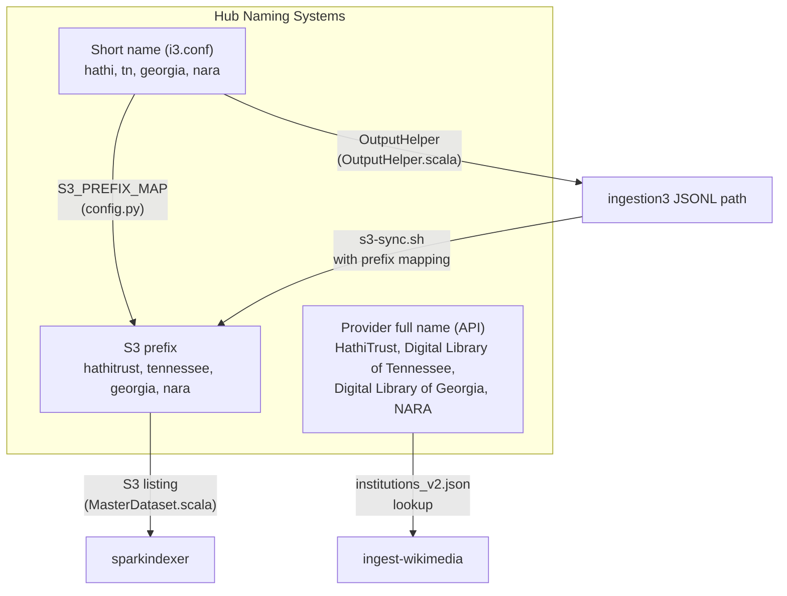
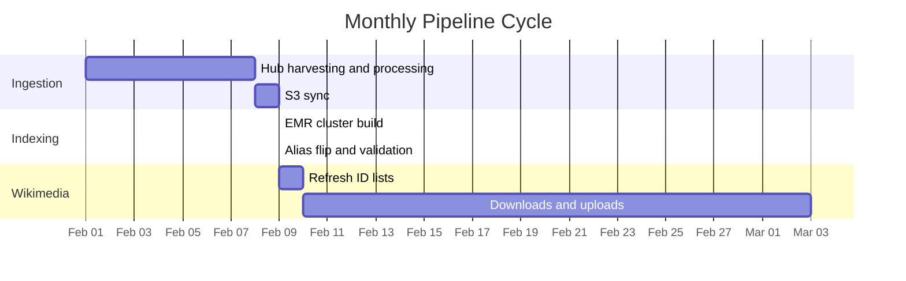
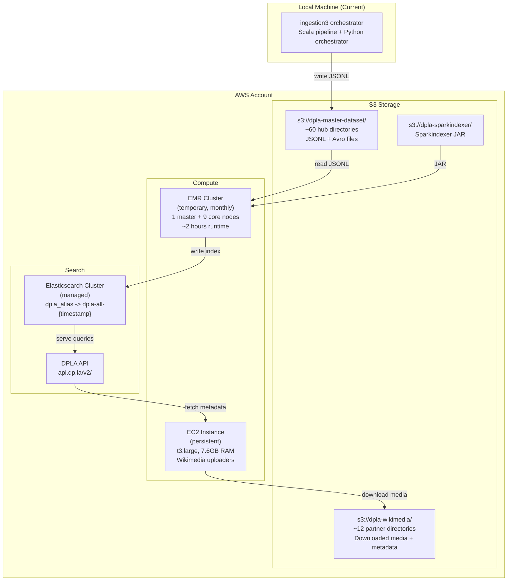
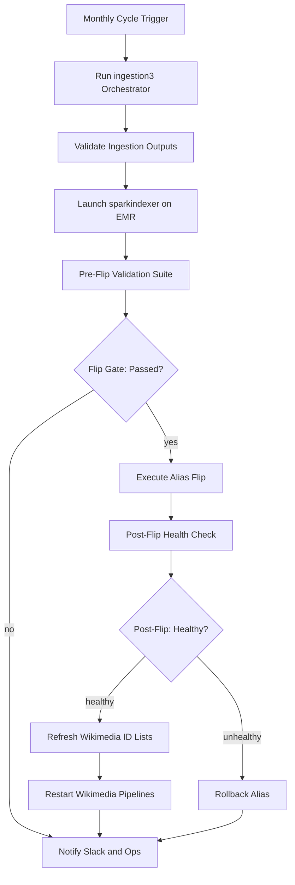

# DPLA Pipeline Unification -- System Architecture

**Audience:** Technical managers, architects, engineers at receiving organization
**Reading time:** 30 minutes

---

## System Overview

DPLA's data pipeline is three independent software projects that form a sequential chain. Each project has its own language, runtime environment, deployment model, and operational cadence. They are coupled through data artifacts and naming conventions, not through a shared control plane.

```mermaid
flowchart LR
    subgraph ingestion3 ["Stage 1: ingestion3 (Scala + Python)"]
        H[Harvest] --> M[Map] --> E[Enrich] --> J[JSONL Export] --> S3Sync[S3 Sync]
    end

    subgraph sparkindexer ["Stage 2: sparkindexer (Scala/Spark)"]
        ReadS3[Read S3 JSONL] --> Transform[Transform + Tag] --> ESWrite[Write to ES] --> Flip[Alias Flip]
    end

    subgraph wikimedia ["Stage 3: ingest-wikimedia (Python)"]
        GetIDs[Get Eligible IDs] --> Download[Download Media] --> Upload[Upload to Commons]
    end

    S3Sync -->|"JSONL in S3"| ReadS3
    Flip -->|"API serves fresh data"| GetIDs
```



| Property | ingestion3 | sparkindexer | ingest-wikimedia |
|----------|-----------|--------------|------------------|
| Language | Scala 2.13 + Python 3.11 | Scala 2.12 | Python 3.13 |
| Runtime | Local machine (laptop) | AWS EMR (10-node cluster) | Persistent EC2 instance |
| Cadence | Monthly (~1 week) | Monthly (~2 hours) | Continuous (weeks/months) |
| Trigger | Manual or orchestrator | Manual script | Manual tmux session |
| Monitoring | Slack via orchestrator | None | None |
| Repository | `dpla/ingestion3` | `dpla/sparkindexer` | `dpla/ingest-wikimedia` |

---

## Data Flow and Handoff Points

Data moves between stages through three handoff points. Each is a potential failure point if the format or location changes in one project but not the other. Formal contracts for each handoff are defined in [03-integration-contracts-and-gates.md](03-integration-contracts-and-gates.md).

### Handoff 1: ingestion3 to sparkindexer (S3 JSONL)

```
ingestion3 writes:
  s3://dpla-master-dataset/{s3-prefix}/jsonl/{timestamp}-{hub}-MAP3_1.IndexRecord.jsonl/
  Example: s3://dpla-master-dataset/georgia/jsonl/20260215_103600-georgia-MAP3_1.IndexRecord.jsonl/

sparkindexer reads:
  Lists s3://dpla-master-dataset/{provider}/jsonl/
  Selects the most recent directory by lexicographic string comparison on the full key
```

**Risk:** The `{s3-prefix}` that ingestion3 writes is not always the same as the hub's short name. A mapping exists in ingestion3's `scheduler/orchestrator/config.py` (e.g., `hathi` -> `hathitrust`, `tn` -> `tennessee`). If a new hub is added with a different S3 prefix, both the ingestion3 mapping and sparkindexer's S3 listing must handle it. There is no validation that they agree.

### Handoff 2: sparkindexer to DPLA API (Elasticsearch)

```
sparkindexer writes:
  Elasticsearch index: dpla-all-{yyyyMMdd-HHmmss}

  After validation, the alias 'dpla_alias' is pointed to the new index.

DPLA API reads:
  Queries 'dpla_alias' which resolves to the current index.
```

The alias flip is atomic (Elasticsearch guarantees this), but validation before the flip is minimal today. The pre-flip safety gate defined in [03-integration-contracts-and-gates.md](03-integration-contracts-and-gates.md) addresses this.

### Handoff 3: DPLA API to ingest-wikimedia (HTTP API)

```
ingest-wikimedia reads:
  https://api.dp.la/v2/items/{dpla_id}

  Key fields consumed:
    provider.name          -- Hub identity (must match institutions_v2.json keys)
    rightsCategory         -- Eligibility check ("Unlimited Re-Use")
    mediaMaster            -- Direct media URLs
    iiifManifest           -- IIIF manifest URL (alternative to mediaMaster)
    sourceResource.*       -- Metadata for Wikimedia wikitext
```

**Risk:** ingest-wikimedia looks up the hub in `institutions_v2.json` using the `provider.name` value from the API response. This name must match exactly. The file is fetched from GitHub at runtime, and different tools in the same repo fetch from different branches (`main` vs `develop`).

---

## The Three Hub Naming Systems

One of the most fragile integration points is hub naming. Three different naming systems exist with no centralized mapping:



**Canonical sources today (fragmented):**
- Short name to S3 prefix: `scheduler/orchestrator/config.py` (`S3_PREFIX_MAP`)
- S3 prefix to full name: `institutions_v2.json` (maintained in ingestion3, fetched by ingest-wikimedia)
- Full name as returned by DPLA API: determined by what sparkindexer writes to `provider.name` in the ES index

**Target:** A single canonical hub registry that maps all three naming systems. See Contract 1 in [03-integration-contracts-and-gates.md](03-integration-contracts-and-gates.md).

---

## The Monthly Cycle

The full monthly pipeline takes approximately 1--2 weeks from start to finish.



### Step-by-Step

**Week 1: Ingestion (ingestion3)**

1. Engineer starts the orchestrator: `python -m scheduler.orchestrator.main --month=2 --parallel=3`
2. Orchestrator reads hub schedule from `i3.conf`, determines which hubs to process
3. For each hub (up to 3 in parallel): harvest -> map -> enrich -> JSONL export -> anomaly check -> S3 sync
4. Orchestrator sends Slack notifications at each stage transition
5. On completion, generates email drafts for hub contacts

**Week 1, Day 7--8: Indexing (sparkindexer)**

1. Engineer builds the sparkindexer JAR and uploads to S3
2. Launches EMR cluster via `sparkindexer-emr.sh`
3. EMR reads all JSONL from S3, transforms records, writes to a new ES index (~2 hours)
4. Cluster auto-terminates on completion
5. Engineer runs alias flip script to point production at the new index
6. Verifies the DPLA API serves fresh data

**Week 2+: Wikimedia Uploads (ingest-wikimedia)**

1. Engineer SSHs to EC2 instance
2. Runs `get-ids-api` to generate fresh ID lists per partner
3. Launches downloaders and uploaders in tmux sessions
4. Processes run for days/weeks per partner
5. No monitoring unless engineer manually checks logs

### What Can Go Wrong at Each Step

| Step | Failure Mode | Detection Today | Detection After Unification |
|------|-------------|-----------------|----------------------------|
| Harvest | Hub endpoint down or timing out | Slack alert from orchestrator | Same (already works) |
| Map/Enrich | Bad data causes mapping failure | Slack alert from orchestrator | Same (already works) |
| S3 Sync | Sync interrupted, partial data | None | Post-sync verification (Phase 1) |
| EMR Launch | Cluster fails to start | Manual EMR console check | Slack alert (Phase 3) |
| ES Write | Records silently fail to write | None (errors swallowed) | Exit code fix + count check (Phases 1, 3) |
| Alias Flip | Flip to partial/empty index | Manual spot-check | Pre-flip gate + auto-rollback (Phase 3) |
| Wikimedia Download | Connection error, stall | None (SSH log check) | Daily Slack digest (Phase 2) |
| Wikimedia Upload | Session timeout, silent failure | None (SSH log check) | Stall detection + auto-restart (Phases 2, 4) |

---

## AWS Resource Map



### Current AWS Resources

| Resource | Type | Region | Notes |
|----------|------|--------|-------|
| dpla-master-dataset | S3 bucket | us-east-1 | ~2TB, all hub JSONL and Avro data |
| dpla-wikimedia | S3 bucket | us-east-1 | Downloaded media staging area |
| dpla-sparkindexer | S3 bucket | us-east-1 | Sparkindexer JAR for EMR |
| EMR cluster | Temporary | us-east-1 | 10 nodes, m5.2xlarge, created/destroyed monthly |
| EC2 (wikimedia) | Persistent | us-east-1 | t3.large, 311+ days uptime, no config management |
| Elasticsearch | Managed cluster | us-east-1 | Hosts dpla_alias, search.internal.dp.la |

### Hardcoded AWS Values (Risk)

The following AWS resource identifiers are hardcoded in `sparkindexer-emr.sh`:
- Security groups: `sg-07459c7a`, `sg-0e4ef863`, `sg-6af5b311`
- Subnet: `subnet-90afd9ba`
- Instance profile: `sparkindexer-s3`
- Service role: `EMR_DefaultRole`
- Log URI: `s3://dpla-sparkindexer/logs/`

These must be extracted to configuration for handoff. See finding SI-C3 in [05-technical-findings.md](05-technical-findings.md).

---

## Target-State Architecture

The target is a coordination control plane that orchestrates existing engines without replacing them.



### Architecture Constraints to Respect

- `ingestion3` remains mixed Python/Scala with local/Spark resource sensitivity
- `sparkindexer` runtime assumes EMR-style execution profile
- `ingest-wikimedia` is long-running and operationally different from monthly batch workflows

Forcing these into one runtime model increases risk; orchestrating them as independent engines reduces risk.

### Recommended Deployment Approach

**For initial implementation (Phases 0--3):** Lightweight Python coordinator. Can run on the engineer's machine, on the existing Wikimedia EC2, or on a new EC2 instance. Uses AWS CLI and boto3 for cross-service coordination. Communicates via Slack webhooks and SNS for notifications.

**For handoff to a new organization (Phase 4+):** Move the ingestion orchestrator to a dedicated EC2 instance (eliminates the laptop dependency). Harden the Wikimedia EC2 with systemd services and monitoring. Add CloudWatch alarms for cost and health.

**For future modernization (post-handoff):** Consider AWS Step Functions for deterministic stage gating, retries, and audit trail. Consider OpenTofu for infrastructure-as-code with a segregated orchestration stack. These provide stronger guarantees but are a larger initial investment. The phased approach ensures the simpler implementation is proven before committing to more infrastructure.

### Why the Conservative Path First

| Option | Strength | Weakness | When to Use |
|--------|----------|----------|-------------|
| Python coordinator + EC2 | Smallest change, familiar tools, easy to debug | Manual patching, potential drift | Phases 0--4, immediate implementation |
| Step Functions + Lambda + EventBridge | Strongest gate semantics, built-in retry, full audit trail | Higher learning curve, more AWS services | Post-handoff modernization |
| OpenTofu orchestration stack | Reproducible infrastructure, clean ownership boundaries | Additional upfront architecture work | When infrastructure ownership changes |

The conservative path (Python + EC2) is recommended because it can be implemented incrementally, tested at each step, and operated by anyone with basic AWS and Python skills. The Step Functions path is the stronger long-term architecture but requires more upfront investment and AWS expertise. Document both; implement the simpler one first.

---

## Cross-Project DPLA API Field Contract

Fields that ingest-wikimedia depends on (must exist in the ES index built by sparkindexer):

| Field Path | Type | Used For |
|------------|------|----------|
| `id` | string | Record identity, S3 path construction |
| `provider.name` | string | Hub lookup in institutions_v2.json |
| `dataProvider.name` | string | Contributing institution identity |
| `sourceResource.title` | string/array | Wikimedia page title and description |
| `sourceResource.date` | object/array | Wikitext metadata |
| `sourceResource.creator` | string/array | Wikitext metadata |
| `sourceResource.description` | string/array | Wikitext metadata |
| `sourceResource.subject` | object/array | Wikitext metadata |
| `sourceResource.identifier` | string/array | Wikitext local identifiers |
| `rights` | string | Wikitext rights statement |
| `edmRights` | string | License URI for Wikimedia template mapping |
| `rightsCategory` | string | Eligibility check ("Unlimited Re-Use") |
| `isShownAt` | string | Source URL in wikitext |
| `mediaMaster` | string/array | Direct media download URLs |
| `iiifManifest` | string | IIIF manifest URL (alternative media source) |

---

## Dependency Chain Summary

```
All hubs ingested     -->  Indexer can run    -->  Alias flipped     -->  Wikimedia sees fresh data
(~60 hubs, ~1 week)       (~2 hours, EMR)         (~5 min, gated)       (continuous, weeks)
```

Running the indexer before all hubs finish means the new index has stale data for unfinished hubs. Running wikimedia ID refresh before the alias flip means it fetches IDs from the old index and may miss new records. The alias flip is the single most critical moment in the cycle: it switches what millions of users see on dp.la. It must be validated before execution and reversible after.
