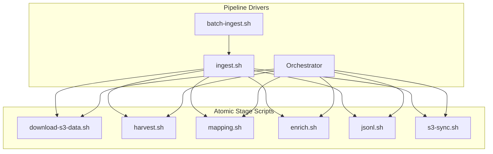

# Ingest Pipeline Decomposition Plan

## Goal

Reduce from 5 ways to run an ingest (auto-ingest.sh, ingest.sh, batch-ingest.sh, remap.sh, orchestrator) to 3 clear paths with consistent building blocks:

- **ingest.sh** -- single hub, full pipeline (calls atomic scripts)
- **batch-ingest.sh** -- multiple hubs (calls ingest.sh per hub)
- **Orchestrator** -- parallel, scheduled, with Slack/notifications (calls atomic scripts)

All paths use the same atomic stage scripts, so status reporting, error handling, and contracts are identical everywhere.

## Architecture



## Contracts: Every Atomic Script

Each atomic stage script follows the same pattern:

| Property | Contract |
|----------|----------|
| **Arguments** | `<hub> [input-path]` -- hub name required, optional explicit input |
| **Input** | If no input-path given, auto-resolve via `find_latest_data <hub> <prev-stage>` |
| **Output** | Writes to `$DPLA_DATA/<hub>/<stage>/<timestamp>-<hub>-*` |
| **Success marker** | `_SUCCESS` file in output directory (written by Spark) |
| **Status** | Calls `write_hub_status <hub> <stage>` on entry, trap writes `failed` on error |
| **Exit code** | 0 = success, non-zero = failure |
| **Idempotent cleanup** | Removes incomplete dirs (have `_temporary` but no `_SUCCESS`) before running |

### Stage handoff table

```
Stage              Status value    Input source                Output location
────────           ────────────    ────────────                ───────────────
download-s3-data   preparing       S3 source bucket            $DPLA_DATA/<hub>/originalRecords/
harvest            harvesting      i3.conf endpoint            $DPLA_DATA/<hub>/harvest/
mapping            mapping         harvest/ (latest)           $DPLA_DATA/<hub>/mapping/
enrich             enriching       mapping/ (latest)           $DPLA_DATA/<hub>/enrichment/
jsonl              jsonl_export    enrichment/ (latest)        $DPLA_DATA/<hub>/jsonl/
s3-sync            syncing         $DPLA_DATA/<hub>/           s3://dpla-master-dataset/<hub>/
```

---

## Part 1: s3-latest.sh -- Add `--stage` and `--date-only`

**File:** `scripts/status/s3-latest.sh`

- `--stage=harvest|mapping|jsonl` -- query only that stage (1 AWS call instead of 3)
- `--date-only` -- output only the latest date as `YYYY-MM-DD` or `---`
- No flags = current behavior (all three stages)

```bash
s3-latest.sh mwdl                              # All stages (current)
s3-latest.sh mwdl --stage=jsonl                # Only jsonl
s3-latest.sh mwdl --stage=jsonl --date-only    # Just "2026-02-10"
```

---

## Part 2: schedule.sh -- Add "Latest data" column

**File:** `scripts/communication/schedule.sh`

- In `show_month()`: call `s3-latest.sh $hub --stage=jsonl --date-only` per hub
- Add "Latest data" column to the table
- Add `--no-s3` flag to skip S3 lookups for speed

```
February Ingests (12 hubs)
────────────────────────────────────────────────────────────────────────
  hub                provider                          freq       Latest data
  mwdl               Mountain West Digital Library     monthly    2026-02-10
  vt                 Vermont                           quarterly  2025-11-18
  nypl               NYPL                              monthly    ---
```

---

## Part 3: Add status tracking to atomic scripts

Currently `mapping.sh`, `enrich.sh`, `jsonl.sh`, and `s3-sync.sh` don't call `write_hub_status`. Only `harvest.sh`, `ingest.sh`, and `remap.sh` do. For consistent status reporting, each atomic script needs:

- `write_hub_status <hub> <stage>` at entry
- Trap that writes `write_hub_status <hub> failed --error="Exit $err"` on non-zero exit

### Changes per script

- **mapping.sh:** Add trap + `write_hub_status "$PROVIDER" mapping`
- **enrich.sh:** Add trap + `write_hub_status "$PROVIDER" enriching`
- **jsonl.sh:** Add trap + `write_hub_status "$PROVIDER" jsonl_export`
- **s3-sync.sh:** Add trap + `write_hub_status "$HUB" syncing`
- **write_status.py:** Update help text (line 69) to list `mapping, enriching, jsonl_export` as valid status values

---

## Part 4: Refactor ingest.sh as a pipeline driver

**File:** `scripts/ingest.sh`

Currently `ingest.sh` calls Scala entry points directly (HarvestEntry via `sbt`, IngestRemap via `run_ingest_remap`). Refactor it to chain the atomic scripts.

### Current behavior (direct Scala calls)

```
ingest.sh:
  1. sbt runMain HarvestEntry     (not harvest.sh)
  2. run_ingest_remap              (not mapping/enrich/jsonl)
  3. s3-sync.sh
```

### New behavior (chains atomic scripts)

```
ingest.sh <hub>:
  0. If file hub → download-s3-data.sh <hub>    (auto-detect via get_harvest_type)
  1. harvest.sh <hub>                            (unless --skip-harvest)
  2. mapping.sh <hub>
  3. enrich.sh <hub>
  4. jsonl.sh <hub>
  5. s3-sync.sh <hub>                            (unless --skip-s3-sync)
```

### Key changes

- Replace direct `sbt runMain HarvestEntry` with `"$SCRIPT_DIR/harvest.sh" "$PROVIDER"`
- Replace `run_ingest_remap` with sequential calls to `mapping.sh`, `enrich.sh`, `jsonl.sh`
- Add file-hub detection: call `get_harvest_type "$PROVIDER"` (already in common.sh); if `file`, run `"$SCRIPT_DIR/harvest/download-s3-data.sh" "$PROVIDER"` as step 0
- Keep `--skip-harvest`, `--harvest-only`, `--skip-s3-sync` flags
- Status tracking happens inside each atomic script (Part 3), so ingest.sh just chains and checks exit codes

---

## Part 5: Remove remap.sh

**File:** `scripts/remap.sh` -- delete

`remap.sh` is redundant because `ingest.sh --skip-harvest --skip-s3-sync` does the same thing (mapping + enrich + jsonl on existing harvest data). Or run individual stages directly:

```bash
./scripts/ingest.sh maryland --skip-harvest --skip-s3-sync   # replaces remap.sh
./scripts/mapping.sh maryland && ./scripts/enrich.sh maryland && ./scripts/jsonl.sh maryland
```

### What references remap.sh (must update)

- `scripts/SCRIPTS.md` -- Quick Reference table, Script Locations, Script Relationships diagram
- `scripts/tests/test-scripts.sh` -- script arrays (lines 215, 268, 481, 584, 685-694, 713)
- `scheduler/orchestrator/hub_processor.py` -- `remap()` method (line 346); remove it
- `.cursor/skills/dpla-run-ingest/SKILL.md`
- `.cursor/skills/dpla-monitor-ingest-remap/SKILL.md`
- `.cursor/skills/dpla-ingest-debug/SKILL.md`
- `.claude/rules/run-ingest.md`
- `AGENTS.md` (line 36)
- `docs/ingestion/GOLDEN_PATH.md` (line 120)
- `docs/ingestion/README_NARA.md` (line 286)
- `REMAPPING` status in `scheduler/orchestrator/state.py` -- keep as legacy alias, mark deprecated

---

## Part 6: Remove auto-ingest.sh and create download-s3-data.sh

### Edge cases

- **Smithsonian preprocessing:** auto-ingest.sh's `preprocess_smithsonian()` is deleted. hub_processor.py's `_preprocess_smithsonian()` is unaffected (self-contained Python). For manual runs, `download-s3-data.sh` calls `fix-si.sh --update-conf` for Smithsonian.
- **`.latest_endpoint` breadcrumb:** `download-s3-data.sh` must write `$DPLA_DATA/<hub>/originalRecords/.latest_endpoint` after download.
- **JSONL zipping:** File harvester expects `.zip`; bare `.jsonl` files must be zipped after download.
- **Hub-to-bucket mapping duplication:** Bash (new script) and Python (`config.py` `S3_SOURCE_BUCKETS`) must stay in sync; add cross-reference comments.
- **`COMMON_NO_INIT=1` hack:** Eliminated. New script is standalone, called as subprocess.

### Step 6a: Create `scripts/harvest/download-s3-data.sh`

Extract from `scripts/auto-ingest.sh`: `get_s3_source_bucket()` (lines 132-146) and `download_s3_data()` (lines 268-328).

- Source common.sh normally
- Accept `<hub>` as argument
- Exit 0 for OAI/API hubs (no-op) or on success; exit 1 on failure
- Write `.latest_endpoint` breadcrumb
- Zip bare `.jsonl` files
- For Smithsonian: call `fix-si.sh --update-conf` on downloaded folder
- Write `write_hub_status <hub> preparing`

### Step 6b: Add `--update-conf` to `scripts/harvest/fix-si.sh`

When passed, update `smithsonian.harvest.endpoint` in i3.conf after processing (using `sed_i`). Without the flag, existing behavior preserved.

### Step 6c: Update `scheduler/orchestrator/hub_processor.py`

Replace the `prepare()` download block (lines 114-131):

```python
result = await self._run_command(
    f"cd {self.config.i3_home} && "
    f"./scripts/harvest/download-s3-data.sh {self.hub_name}"
)
```

Remove the `aws s3 ls` pre-check. Keep `_preprocess_smithsonian()` as-is (Python path works independently).

### Step 6d: Delete auto-ingest.sh and update references

- Delete `scripts/auto-ingest.sh`
- `scripts/SCRIPTS.md`: Remove from all tables and details
- `scripts/tests/test-scripts.sh`: Remove from script arrays (lines 208, 261, 316, 474)

---

## Documentation Updates

| File | Changes |
|------|---------|
| `scripts/SCRIPTS.md` | Remove auto-ingest.sh and remap.sh; add download-s3-data.sh; update ingest.sh; update fix-si.sh; update s3-latest.sh; update schedule.sh; rewrite Script Relationships diagram |
| `.claude/skills/s3-latest/SKILL.md` | Document --stage and --date-only |
| `.claude/skills/dpla-hub-info/SKILL.md` | Note schedule.sh includes Latest data column |
| `.cursor/skills/dpla-hub-info/SKILL.md` | Same |
| `.cursor/skills/dpla-run-ingest/SKILL.md` | Replace remap.sh; note ingest.sh auto-handles file hubs |
| `.cursor/skills/dpla-monitor-ingest-remap/SKILL.md` | Update remap references |
| `.cursor/skills/dpla-ingest-debug/SKILL.md` | Replace remap.sh with individual stages |
| `.claude/rules/run-ingest.md` | Remove remap.sh reference |
| `AGENTS.md` | Remove remap.sh and auto-ingest.sh references |
| `docs/ingestion/GOLDEN_PATH.md` | Update remap.sh reference |
| `docs/ingestion/README_NARA.md` | Update remap.sh reference |
| `scheduler/orchestrator/config.py` | Cross-reference comment on S3_SOURCE_BUCKETS |

---

## Execution Order

1. Add `--stage` and `--date-only` to s3-latest.sh (Part 1)
2. Add "Latest data" column to schedule.sh (Part 2)
3. Add status tracking to mapping.sh, enrich.sh, jsonl.sh, s3-sync.sh (Part 3)
4. Add `--update-conf` to fix-si.sh (Part 6b)
5. Create download-s3-data.sh (Part 6a)
6. Refactor ingest.sh to chain atomic scripts + auto-detect file hubs (Part 4)
7. Update hub_processor.py to call download-s3-data.sh (Part 6c)
8. Delete remap.sh and update references (Part 5)
9. Delete auto-ingest.sh and update references (Part 6d)
10. Update all documentation (SCRIPTS.md, skills, rules, AGENTS.md)
11. Run test suite

---

## Testing

1. **s3-latest.sh**: `s3-latest.sh mwdl`, `--stage=jsonl`, `--stage=jsonl --date-only`
2. **schedule.sh**: `schedule.sh feb` and `schedule.sh feb --no-s3`
3. **Atomic status**: Run `mapping.sh maryland` and verify `ingest-status.sh` shows "Mapping" stage
4. **ingest.sh refactor**: Run `ingest.sh maryland` end-to-end; verify status shows individual stages
5. **ingest.sh --skip-harvest**: Verify this replaces remap behavior
6. **ingest.sh file hub**: Run for a file hub (e.g. vt); verify download-s3-data.sh is called automatically
7. **download-s3-data.sh**: Run standalone for florida/vt; run for an OAI hub (exit 0 no-op)
8. **fix-si.sh --update-conf**: Verify i3.conf endpoint update
9. **Orchestrator**: Run a file-hub ingest to confirm prepare step uses download-s3-data.sh
10. **test-scripts.sh**: Full suite, fix failures from removed/added scripts
